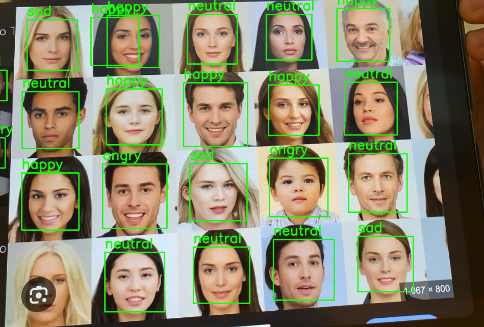

# Rozpoznawanie emocji za pomocą sieci neuronowych

## Opis projektu

Ten projekt to aplikacja, która rozpoznaje emocje na podstawie obrazów twarzy za pomocą konwolucyjnych sieci neuronowych (CNN).  
Głównym celem jest wykorzystanie technologii głębokiego uczenia do klasyfikacji obrazów twarzy na różne emocje, takie jak radość, smutek, złość itp.

## Cel projektu

Celem projektu jest:

1. Zbudowanie modelu zdolnego do rozpoznawania emocji z obrazów twarzy.
2. Przeprowadzenie treningu modelu na zestawie danych obrazów twarzy.
3. Stworzenie aplikacji, która wykorzystuje kamerę do bieżącego rozpoznawania emocji na podstawie twarzy użytkownika.

## Dane

Zestaw danych został podzielony na dwie części:

- **Dane treningowe** znajdujące się w folderze `images/train-kopia/`.
- **Dane walidacyjne** znajdujące się w folderze `images/validation/`.

Każdy folder zawiera podkatalogi odpowiadające emocjom, np. `happy`, `sad`, `angry` itp.  
W każdym podkatalogu znajdują się obrazy twarzy odpowiadające danej emocji.

Zestaw danych pochodzi z platformy [Keggle](https://www.kaggle.com/code/jonathanoheix/face-expression-recognition-with-deep-learning/input).

> **Uwaga:** Zestaw danych został zebrany z publicznie dostępnych źródeł lub został wygenerowany na potrzeby tego projektu.  
Pamiętaj, aby sprawdzić i przestrzegać licencji użytych danych.

## Wykorzystane technologie

1. **Python** - język programowania użyty do analizy i budowy modelu.
2. **TensorFlow / Keras** - biblioteka do budowy i trenowania sieci neuronowych.
3. **OpenCV** - biblioteka do przetwarzania obrazów i obsługi kamery.
4. **Matplotlib** - do wizualizacji wyników i statystyk.
5. **NumPy** - do obliczeń numerycznych i manipulacji danymi.

## Uwagi końcowe
Projekt realizowany na zajęcia Podstawy sztucznej inteligencji AGH i jest przeznaczony wyłącznie do celów edukacyjnych.
W przypadku wykorzystania zestawu danych lub aplikacji w innych celach, upewnij się, że przestrzegasz przepisów dotyczących ochrony danych osobowych i prywatności.
